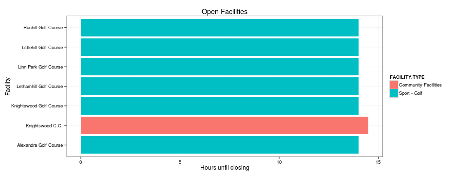

# Open Data

"We know that half our advertising money is wasted &mdash; we just don't know which half!"
(popular business aphorism)

* Equally, a lot of data put out under open government is low-quality and not particularly useful
* But when it's all out there, you can grab scraps pretty easily!

# Open Glasgow

Glasgow city council has done some great work as part of the FutureCities project to make the city more accessible and data-driven. The portal at http://open.glasgow.gov.uk had many datasets added in February 2015, and is kept updated. The individual datasets have data dictionaries and can be downloaded as CSV.

* Good: Available at all, Documented, and in a Hacker-friendly format
* Bad: Data isn't very clean

---

# Using the data

I took the messy, human-readable opening times and processed them to make building opening times programatically accessible.

We went from this:


```r
source(file = "glasgowsopen.R")
head(openinghours[,1:5],2)
```

```
##          FACILITY.TYPE  FACILITY.NAME        MONDAY       TUESDAY
## 1 Sport - Glasgow Club Barlia Complex    10am - 9pm   10am - 10pm
## 2 Sport - Glasgow Club   Bellahouston 6.30am - 10pm 6.30am - 10pm
##       WEDNESDAY
## 1   10am - 10pm
## 2 6.30am - 10pm
```

Semi-consistent format for times, but ultimately a string with variable numbers of digits, spaces, and different separators.

---

# Using the data

Tidied, it looks like this


```r
head(tidyopeninghours[,-(4:6)],4)
```

```
##          FACILITY.TYPE   FACILITY.NAME variable opentime closetime
## 1 Sport - Glasgow Club  Barlia Complex   MONDAY    10:00     21:00
## 2 Sport - Glasgow Club    Bellahouston   MONDAY    06:30     22:00
## 3 Sport - Glasgow Club      Castlemilk   MONDAY    10:00     21:00
## 4 Sport - Glasgow Club Castlemilk Pool   MONDAY    09:00     21:00
```

Now we can plot away!

---

# So who's up early?

Now we can see what facilities are open at 7am on a Sunday.
 
Ready to tee off? Try the app at https://derwin.shinyapps.io/firstgo , and read the code at https://github.com/derwinmcgeary/DDP

